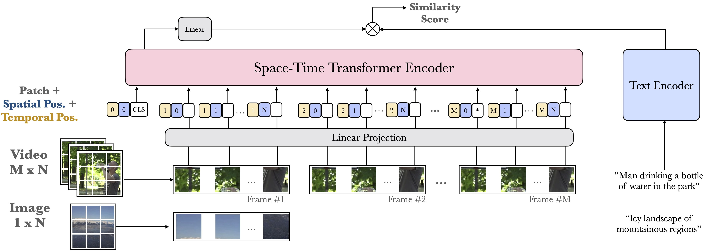

# Frozen️ in Time ❄️️️️️⏳
### A Joint Video and Image Encoder for End-to-End Retrieval
([arXiv](https://arxiv.org/abs/2104.00650))
----
Repository to contain the code, models, data for end-to-end retrieval.

### Work in progress ###

Code provided to train end-to-end model on MSRVTT.

Set path locations in `msrvtt_4f_i21k.json`

`python train.py --config configs/msrvtt_4f_i21k.json`

TODO:

[ ] Conda env

[ ] Pretrained models

[ ] webvid data

[ ] Other benchmarks 

